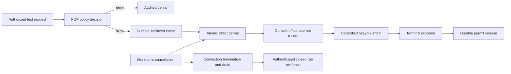

# Strix Secure Execution Pipeline

A research implementation of a policy-enforced execution boundary for an autonomous AI bug-bounty agent.

The end goal is to let Strix, or a comparable security agent, discover, validate, and document vulnerabilities in explicitly authorized bug-bounty targets while the surrounding system enforces scope, credentials, budgets, and emergency shutdown. Every external effect should be preceded by durable authorization evidence and followed by evidence that an independent verifier can evaluate.

The central engineering question is: **how can an autonomous agent perform useful security research without gaining the ability to leave its approved target scope or produce unverifiable claims?**

> [!WARNING]
> This repository is an active security research project. It is not production-ready, is not a certification framework, and must only be used against systems you own or are explicitly authorized to test.

## Current status

This public snapshot corresponds to review candidate `8e924860`.

- Historical Track A validation: 254/254 checks in its original scope
- Sealed historical bundle: 12/12 checks
- Historical measurement battery: 37/37 checks
- Layer B historical derivation: 9/9 checks
- F01 evidence-custody correction: implemented in the verified lineage
- F02/F03 authorization, cancellation, and durable audit lifecycle: implemented and under independent correction
- Track B runtime runtime implementation and production-equivalent validation: not started
- External key custody, WORM publication, external enforcement, and target-host validation: not proven

An independent review found six false-positive E10 verifier cases in this snapshot, including hostname-prefix/userinfo confusion and a missing production `STARTUP` requirement. The findings and remediation requirements are documented in [docs/INDEPENDENT_REVIEW_STATUS.md](docs/INDEPENDENT_REVIEW_STATUS.md). E10-v3 is the planned correction.

## Architecture



The design separates:

- policy decisions from effect execution;
- durable authorization evidence from the later network action;
- global lifecycle order from concurrent JSONL append order;
- local process drain from external enforcement claims;
- historical validation evidence from current release eligibility.

## Intended end-to-end workflow

1. The operator imports a bug-bounty program's authorized scope and constraints.
2. The agent plans and executes research inside an isolated runtime.
3. All outbound traffic passes through the policy decision point and enforcement proxy.
4. Credentials are injected only after the destination, method, policy generation, and budget are approved.
5. The system records authorization, attempted effects, outcomes, and permit release as durable evidence.
6. A monotonic kill switch stops new admissions, terminates retained connections, drains writers, and closes the evidence range.
7. Independent verifiers reject incomplete, contradictory, forged, or weakly bound evidence.
8. Only findings supported by the closed evidence set are eligible for a final vulnerability report.

## Repository layout

| Path | Purpose |
|---|---|
| `pep/` | Policy enforcement proxy, lifecycle state, audit writer, and verifiers |
| `phase2a/` | Policy gateway prototype |
| `phase2b/` | TLS-aware policy gateway prototype |
| `verification/` | Evidence and regression artifacts |
| `RELEASE_REQUIREMENTS.md` | Claim-to-evidence release matrix |
| `ARCHITECTURE_REVIEW.md` | System architecture and standing constraints |
| `E10_V2_TRANSITION_SPEC.md` | Frozen E10-v2 lifecycle specification |

## Local verification

Use an isolated Ubuntu environment. These commands perform local checks and do not authorize testing an external target:

```bash
python3 -m compileall -q pep phase2a phase2b
python3 pep/fixtures/test_e10_lifecycle.py
python3 pep/fixtures/test_gateway_lifecycle.py
python3 pep/fixtures/test_f02_f03_repaired.py
python3 pep/fixtures/test_quiescent_shutdown.py
```

Some proof suites require Linux filesystem and socket behavior. Read each runner before execution. Do not run Strix, Docker, autonomous target execution, or external-network tests until the corresponding release gates are satisfied.

## Security properties under development

- authorization evidence durable before external effect;
- atomic permit/cancellation linearization;
- monotonic kill state with post-kill admission refusal;
- explicit unknown outcomes after ambiguous network failures;
- tamper-evident append-only audit history;
- authenticated binding of a closed evidence range;
- deterministic fail-closed verification;
- exact IPv4/IPv6 destination and request binding.

## Responsible use

This code is intended for defensive engineering and authorized security research. Authorization scope, target ownership, rate limits, data handling, and applicable law remain the operator's responsibility.

Security findings should be reported through GitHub's private vulnerability reporting workflow described in [SECURITY.md](SECURITY.md).

## License

MIT License. See [LICENSE](LICENSE).
